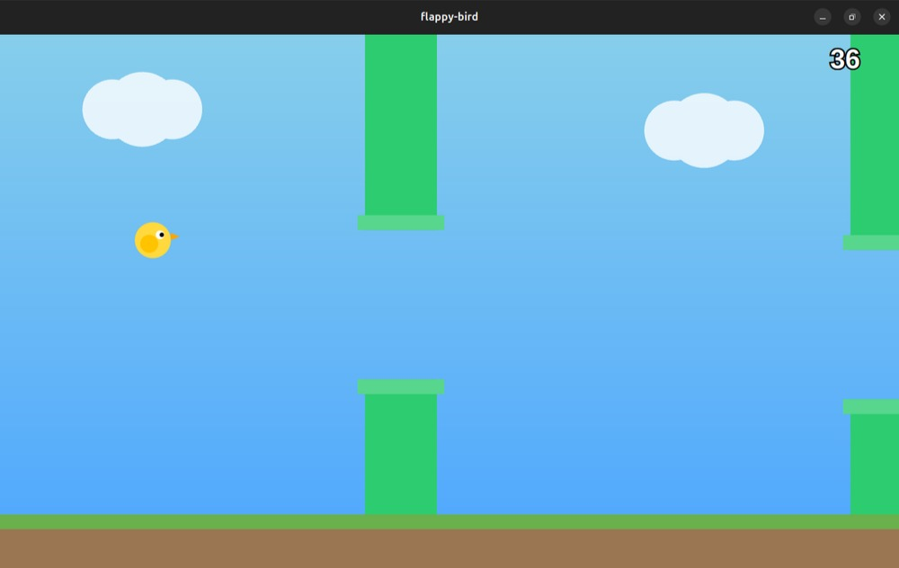
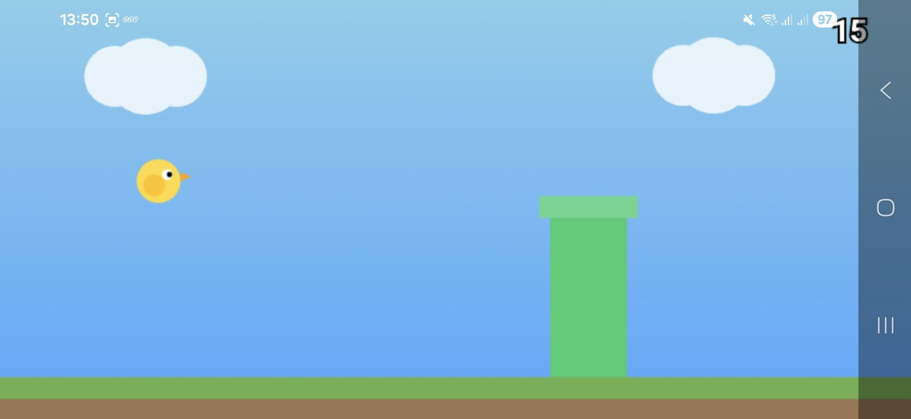

# 🐦 Flappy Bird - Tauri Edition

A modern, responsive implementation of the classic Flappy Bird game built with **Tauri**, **HTML5 Canvas**, **CSS3**, and **Vanilla JavaScript**.

This project combines the simplicity of web technologies with the performance and desktop integration capabilities of Tauri, allowing the game to run as a lightweight cross-platform desktop application.

---

# 🇬🇧 English

## 📖 Overview

Flappy Bird - Tauri Edition is a responsive desktop game inspired by the classic Flappy Bird. The game is rendered using the HTML5 Canvas API and packaged as a native desktop application using Tauri.

The application automatically adapts to different screen sizes and supports both desktop and touch devices.

## 🖼 Screenshots

| Desktop Version | Mobile Version |
|----------------|----------------|
|  |  |

---

## 📁 Project Structure

Flappy-Bird-Tauri/
├── src/
│   ├── index.html
│   ├── main.js
│   └── style.css
├── src-tauri/
│   ├── src/
│   │   └── main.rs
│   ├── Cargo.toml
│   ├── tauri.conf.json
│   └── capabilities/
├── app-icon.png
├── package.json
└── README.md

---

## ✨ Features

- Responsive design for all screen sizes
- Built with Tauri for desktop deployment
- HTML5 Canvas rendering
- Touch support for mobile devices
- Keyboard controls for desktop users
- Dynamic screen resizing
- Random pipe generation
- Real-time score tracking
- Game Over screen with restart functionality
- Lightweight and fast
- No external game engine required

---

## 🛠 Technologies Used

- Tauri
- Rust
- HTML5
- CSS3
- JavaScript (ES6)
- Canvas API

---

## 🎮 Controls

### Desktop

| Key | Action |
|------|---------|
| Space | Jump |
| Arrow Up | Jump |
| R | Restart |

### Touch Devices

| Action | Result |
|---------|---------|
| Tap Screen | Jump |
| Tap After Game Over | Restart |

---

## 📱 Responsive Design

The game dynamically scales based on the current screen dimensions.

Responsive elements include:

- Bird size
- Pipe width
- Pipe spacing
- Ground height
- Score text
- Game Over screen

Supported devices:

- Smartphones
- Tablets
- Laptops
- Desktop Computers
- Full HD Displays
- 2K Displays
- 4K Displays

---

## 🚀 Running the Project

### Install Dependencies

```bash
npm install
```

### Run in Development Mode

```bash
npm run tauri dev
```

### Build Desktop Application

```bash
npm run tauri build
```

---

## 💡 Future Improvements

- FPS-independent movement (Delta Time)
- Sound effects
- High score saving
- Pause menu
- Difficulty levels
- Sprite animations
- Settings menu
- Local storage support

---

## 📄 License

This project is released for educational and personal use.

---

# 🇮🇷 فارسی

## 📖 معرفی

Flappy Bird - Tauri Edition یک پیاده‌سازی مدرن و ریسپانسیو از بازی معروف Flappy Bird است که با استفاده از HTML5 Canvas، JavaScript و Tauri ساخته شده است.

این پروژه با استفاده از فناوری‌های وب توسعه داده شده و توسط Tauri به یک برنامه دسکتاپ سبک، سریع و چندسکویی تبدیل شده است.

---

## ✨ ویژگی‌ها

- طراحی کاملاً ریسپانسیو
- توسعه‌یافته با Tauri
- استفاده از HTML5 Canvas
- پشتیبانی از لمس صفحه
- پشتیبانی از صفحه‌کلید
- سازگاری با تغییر اندازه پنجره
- تولید تصادفی لوله‌ها
- نمایش امتیاز به‌صورت لحظه‌ای
- صفحه پایان بازی
- امکان شروع مجدد بازی
- سبک و کم‌مصرف

---

## 🛠 فناوری‌های استفاده‌شده

- Tauri
- Rust
- HTML5
- CSS3
- JavaScript (ES6)
- Canvas API

---

## 🎮 کنترل بازی

### دسکتاپ

| کلید | عملکرد |
|-------|---------|
| Space | پرش |
| Arrow Up | پرش |
| R | شروع مجدد |

### دستگاه‌های لمسی

| عملیات | عملکرد |
|---------|---------|
| لمس صفحه | پرش |
| لمس پس از پایان بازی | شروع مجدد |

---

## 📱 طراحی ریسپانسیو

بازی به‌صورت خودکار با اندازه صفحه سازگار می‌شود.

عناصر ریسپانسیو:

- اندازه پرنده
- عرض لوله‌ها
- فاصله بین لوله‌ها
- ارتفاع زمین
- اندازه فونت امتیاز
- صفحه پایان بازی

دستگاه‌های پشتیبانی‌شده:

- تلفن همراه
- تبلت
- لپ‌تاپ
- کامپیوتر رومیزی
- نمایشگرهای Full HD
- نمایشگرهای 2K
- نمایشگرهای 4K

---

## 🚀 اجرای پروژه

### نصب وابستگی‌ها

```bash
npm install
```

### اجرای نسخه توسعه

```bash
npm run tauri dev
```

### ساخت نسخه نهایی

```bash
npm run tauri build
```

---

## 🔮 توسعه‌های آینده

- پیاده‌سازی Delta Time
- افزودن افکت‌های صوتی
- ذخیره بهترین رکورد
- منوی توقف بازی (Pause)
- سطح‌های مختلف سختی
- انیمیشن و Sprite
- منوی تنظیمات
- ذخیره اطلاعات محلی

---

## 📄 مجوز

این پروژه برای اهداف آموزشی، تمرینی و شخصی منتشر شده است.